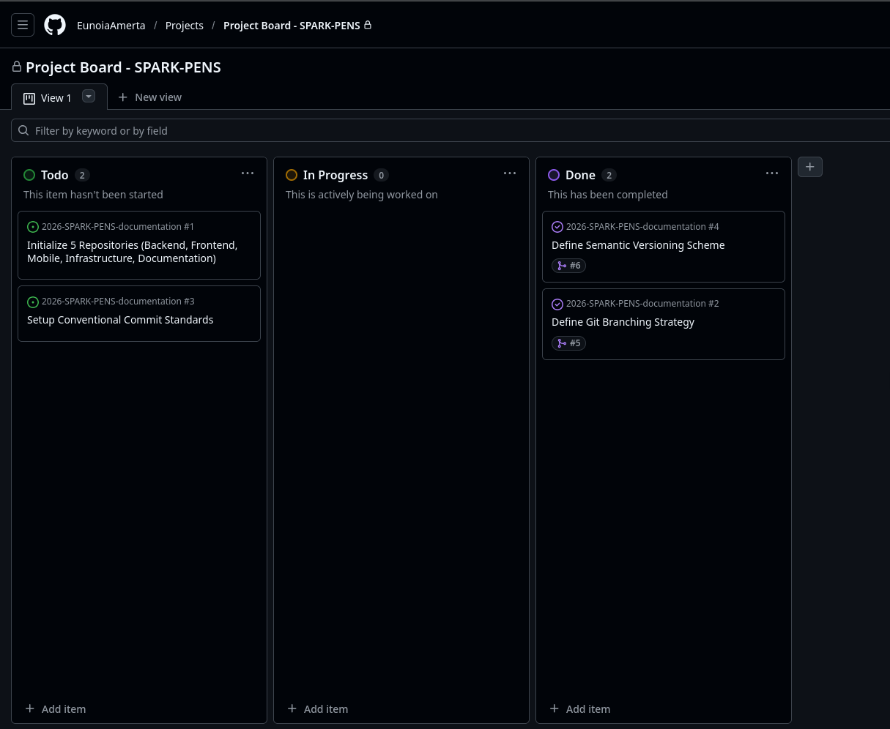

# Learning Log: Git & GitHub

## Stage 0: Inisisasi projek

- Buka GitHub kamu di browser.
- Lihat di barisan menu atas (dekat foto profil kamu), klik menu "Projects".
- Klik tombol hijau "New Project".
- Akan muncul pilihan template, pilih yang "Board" (yang ada kolom-kolomnya).
- Klik "Create".

### Setelah masuk ke halamannya:

- Klik pada tulisan "Untitled Project" di kiri atas, ubah namanya jadi "Project Board - [Nama Projek Pilihanmu]".
- Secara default, dia biasanya sudah membuatkan kolom Todo, In Progress, dan Done.
  Seperti ini hasilnya:
  

## Stage 1: Project Management

### masukkan 4 tugas awal ini ke dalam kolom Todo di Project Board-mu:

- Initialize 5 Repositories (Backend, Frontend, Mobile, Infrastructure, Documentation)
- Define Git Branching Strategy
- Setup Conventional Commit Standards
- Define Semantic Versioning Scheme

### Cara menambahkannya:

- Di bawah kolom Todo, klik tombol + Add item.
- Ketik nama tugasnya (satu per satu), lalu tekan Enter.
- Ulangi sampai keempatnya muncul di kolom Todo.

Tugas-tugas ini statusnya masih berupa Draft (icon-nya biasanya lingkaran putus-putus).
Nanti kita akan ubah ini menjadi Issue setelah kita membuat repositorinya.

### Membuat 5 Repositori Utama

buat 5 repositori baru di GitHub kamu dengan format namanya adalah: 2026-SPARK-PENS-<komponen> berikut:

1. 2026-SPARK-PENS-backend (Untuk kode ASP.NET)
2. 2026-SPARK-PENS-frontend (Untuk kode React/TypeScript)
3. 2026-SPARK-PENS-mobile (Untuk kode Flutter/Mobile)
4. 2026-SPARK-PENS-infrastructure (Untuk konfigurasi server/deployment)
5. 2026-SPARK-PENS-documentation (Untuk dokumen, gambar, dan file PDF tugas)

### Mengubah Draft Menjadi Issue

kembali ke Project Board yang tadi:

- Klik pada salah satu item draft di kolom Todo (misal: "Initialize 5 Repositories").
- Klik tanda panah kecil ke bawah di sebelah judulnya, atau cari tombol "Convert to issue".
- Pilih repositori 2026-SPARK-PENS-documentation sebagai tempat bernaung tugas tersebut.

Lakukan hal yang sama untuk 3 tugas lainnya.

## Stage 2: Branching Strategy

- Menggunakan `main` untuk stable release.
- Menggunakan `develop` untuk integrasi.
- Menggunakan `feature/*` untuk pengerjaan tugas.

### Membuat & Mengatur Branch develop

Menghubungkan Web ke Laptop & Membuat Branch

1. Siapkan Folder di Laptop
   Pilih satu lokasi di laptopmu (misal di Drive D atau folder Documents)
   untuk menyimpan semua project ini. Buat folder baru bernama SPARK-PENS-PROJECT.
2. Ambil Link Repositori
   - Buka GitHub di browser, masuk ke repositori 2026-SPARK-PENS-documentation.
   - Klik tombol hijau bertuliskan "<> Code".\
   - Copy link HTTPS yang muncul (contoh: https://github.com/username/2026-SPARK-PENS-documentation.git).
3. Buka Terminal
   - Buka aplikasi Visual Studio Code (VS Code).
   - Klik menu File > Open Folder, lalu pilih folder SPARK-PENS-PROJECT yang tadi kamu buat.
   - Buka Terminal di dalam VS Code dengan menekan tombol Ctrl + ` (tanda backtick di bawah tombol Esc) atau klik menu Terminal > New Terminal.
4. Mulai Mengetik Perintah (Clone & Branch)
   - Menyalin repo dari web ke laptop: `git clone https://github.com/username/repo-kamu.git`
   - Masuk ke dalam folder repo: `cd 2026-SPARK-PENS-documentation`
   - Membuat branch baru bernama develop: `git checkout -b develop` (Artinya: "Git, tolong buatkan cabang baru namanya develop dan aku langsung pindah ke sana").
   - Mengirim branch baru tersebut kembali ke web GitHub: `git push -u origin develop`
5. Atur Default Branch di Web GitHub
   - Klik menu Settings (tab paling kanan di atas).
   - Di kolom kiri, klik Branches.
   - Lihat bagian Default branch, ada tombol panah dua arah (switch) warna kuning/biru. Klik itu.
   - Ganti dari main ke develop.
   - Klik Update dan konfirmasi.

## Stage 3: Conventional Commit

Format Dasar Conventional Commit: type: description

- feat: untuk fitur baru.
- docs: untuk urusan dokumentasi (seperti yang akan kita lakukan sekarang).
- fix: untuk benerin bug.
- chore: untuk urusan remeh-temeh (bersih-bersih file, dll).
- Contoh: `feat: add login`, `docs: update readme`.

### Dokumentasi Aturan Main

Kita akan mencatat aturan branching kita di dalam file README.md.

1. Update Project Board Buka Project Board kamu di web. Geser kartu "Define Git Branching Strategy" dari kolom Todo ke In Progress. (Ini biar semua orang tahu kamu lagi ngerjain ini).
2. Buat Feature Branch di Terminal Pastikan kamu masih di dalam folder 2026-SPARK-PENS-documentation. Ketik: `git checkout -b feature/branching-strategy` _"Git, buatkan cabang baru namanya feature/branching-strategy (sebagai cabang anak dari tempatku berada sekarang) dan langsung pindahkan aku ke sana untuk mulai bekerja."_
3. Edit File README.md Buka file README.md di VS Code
4. Commit dengan Gaya Pro (Conventional Commit) Ketik ini di terminal:
   - `git add .` _"Git, tandai semua file yang baru saja aku ubah atau aku tambah. Masukkan mereka ke 'keranjang' sementara sebelum aku simpan secara permanen." (Titik . artinya semua file)._
   - `git commit -m "docs: define git branching strategy and commit convention"` _"Git, bungkus dan simpan permanen file-file yang ada di keranjang tadi. Kasih catatan (message) kalau isinya adalah dokumentasi tentang aturan versi."_
5. Push ke GitHub: `git push origin feature/branching-strategy`
6. Cek di halaman repositori sekarang ada "Compare & pull request".

### Pull Request & Linking Issue

1. Klik tombol "Compare & pull request" tersebut.
2. Isi Judul PR: Gunakan conventional commit lagi, misalnya: _docs: define branching strategy and commit convention._
3. Isi Deskripsi: Di bagian kotak besar, tuliskan: Closes #1 (Ganti angka #1 dengan nomor issue "Define Git Branching Strategy" yang ada di Project Board kamu. Kamu bisa lihat nomornya di daftar issue).
   _Tips: Menulis "Closes #Nomor" akan membuat GitHub otomatis memindahkan kartu di Project Board ke kolom Done saat PR ini di-merge. Canggih kan?_
4. Klik tombol hijau "Create pull request".

### Merge ke Develop

Setelah PR dibuat, GitHub akan mengecek apakah ada bentrokan kode (conflict). Kalau tulisannya "This branch has no conflicts":

1. Klik tombol hijau "Merge pull request".
2. Klik "Confirm merge".
3. Setelah selesai, akan muncul tombol "Delete branch". Klik saja itu untuk menjaga repositori tetap bersih (karena fiturnya sudah masuk ke develop).

## Stage 4: Semantic Versioning (SemVer)

Formatnya adalah **MAJOR.MINOR.PATCH.** _contoh: 2.1.5_

- **MAJOR (2)**: Ada perubahan besar yang bikin fitur lama nggak jalan (perombakan total).
- **MINOR (1)**: Ada fitur baru yang ditambahkan, tapi fitur lama masih jalan aman.
- **PATCH (5)**: Cuma benerin bug atau salah ketik, nggak nambah fitur apa-apa.

### Dokumentasi SemVer

1. Update Project Board: Geser kartu **"Define Semantic Versioning Scheme"** ke In Progress.
2. Buat Feature Branch Baru: (Balik ke terminal VS Code)
   `git checkout develop`
   `git pull origin develop`
   `git checkout -b feature/semantic-versioning`
3. Edit README.md: Tambahkan ini di paling bawah:
   <!-- ## Semantic Versioning
   Proyek ini menggunakan standar [SemVer](https://semver.org/):
   **MAJOR**: Perubahan besar/breaking changes.
   **MINOR**: Penambahan fitur baru (backward compatible).
   **PATCH**: Perbaikan bug (backward compatible). -->
4. Commit & Push:
   `git add .`
   `git commit -m "docs: define semantic versioning scheme"`
   `git push origin feature/semantic-versioning` _"Git, kirimkan semua hasil simpanan (commit) di branch fitur ini ke GitHub."_
5. Merge di GitHub: Lakukan Pull Request seperti tadi, lalu Merge ke develop. **(Line 112 until 126)**

### Rilis Versi Pertama (Tagging)

1. Menggabungkan develop ke main (Pull Request)
   Ingat, branch main harus selalu berisi kode yang paling stabil. Karena tadi kita sudah selesai mendokumentasikan aturan di develop, sekarang saatnya kita pindahkan ke main.

- Buka repositori kamu di browser GitHub.
- Klik tab "Pull requests" di bagian atas.
- Klik tombol hijau "New pull request".
- **PENTING (Atur Arah Merge):**
  - Di sebelah kiri (base), pastikan pilih main.
  - Di sebelah kanan (compare), pilih develop.
  - Artinya: Kamu mau narik semua yang ada di develop masuk ke main.
- Klik "Create pull request".
- Beri judul: chore: release v1.0.0-alpha.
- Klik "Create pull request" lagi, lalu klik tombol hijau "Merge pull request" dan "Confirm merge".

2. Membuat "Release" dan "Tag" di GitHub
   Setelah kodenya ada di main, kita beri "label" permanen supaya kalau suatu saat kita mau balik ke versi ini, kita nggak bingung cari commit-nya.

- Di halaman utama repositori (klik tab "Code"), lihat di sisi sebelah kanan. Ada bagian bertuliskan "Releases". Klik tulisan "Create a new release" (atau "Draft a new release").
- Klik tombol "Choose a tag".
- Ketik v1.0.0-alpha di kotaknya, lalu klik "Create new tag: v1.0.0-alpha on publish".
- Di bagian "Target", pastikan terpilih main.
- Release Title: Isi dengan Initial Project Setup and Documentation.
- Description: Tuliskan apa yang sudah selesai, contoh:
  - Setup GitHub Project Board
  - Defined Branching Strategy
  - Defined Conventional Commit Standards
  - Defined Semantic Versioning Scheme
- Klik tombol hijau "Publish Release"

3. Verifikasi di Terminal (Opsional tapi Keren)

- Buka terminal VS Code kamu.
- Ketik: `git fetch --tags` (untuk mengambil data tag dari GitHub ke laptop).
- Ketik: `git tag.`

4. Selesaikan di Project Board
   Terakhir, jangan lupa bereskan "administrasi" kita:

- Buka Project Board kamu.
- Pastikan kartu "Define Semantic Versioning Scheme" sudah berada di kolom Done.
- Kalau ada kartu "Initialize 5 Repositories" yang belum di-Done, pindahkan juga ke sana karena tadi kamu sudah buat semuanya.

## Command Git:

Tips Cepat Mengingat:

- Checkout: Pindah jalur.
- -b: Bikin jalur baru.
- Add: Masukin ke keranjang.
- Commit: Kasih label & segel (simpan).
- Push: Kirim ke atas (awan/GitHub).
- Pull: Tarik ke bawah (laptop).
